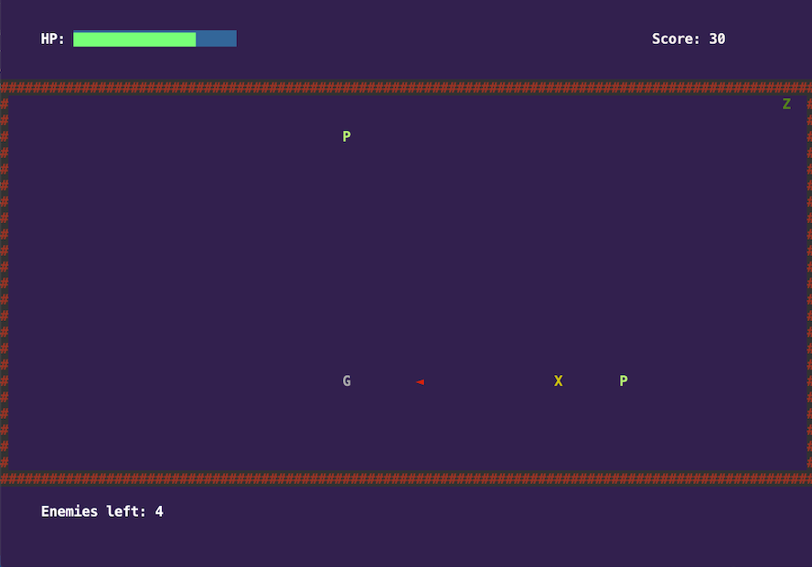
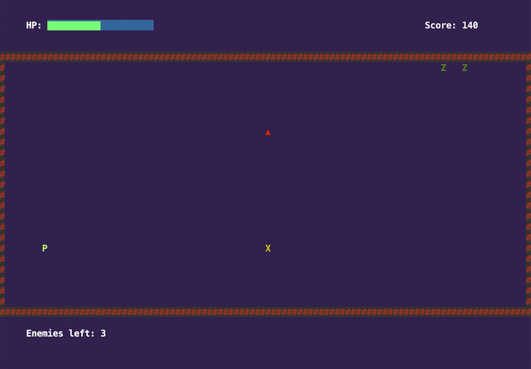
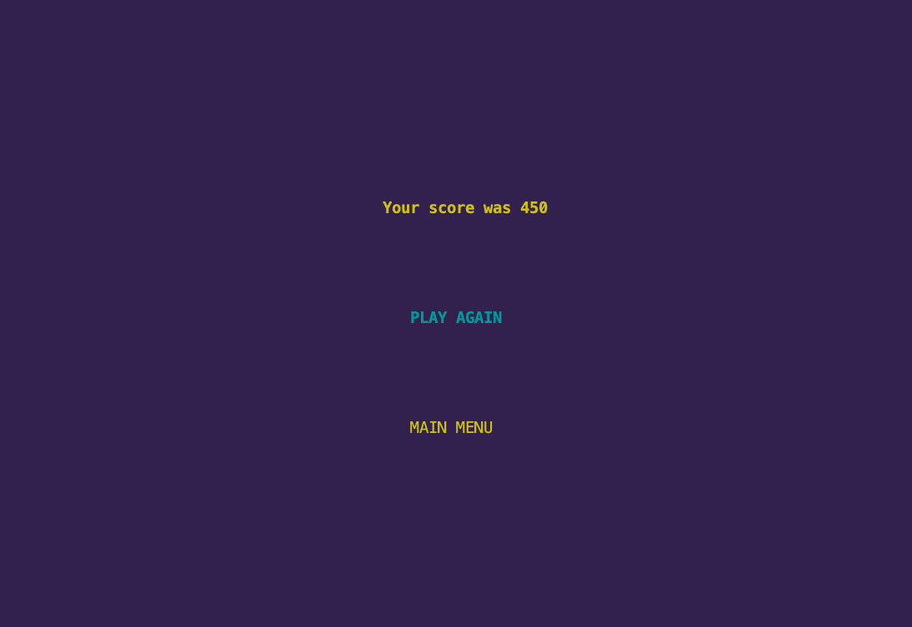
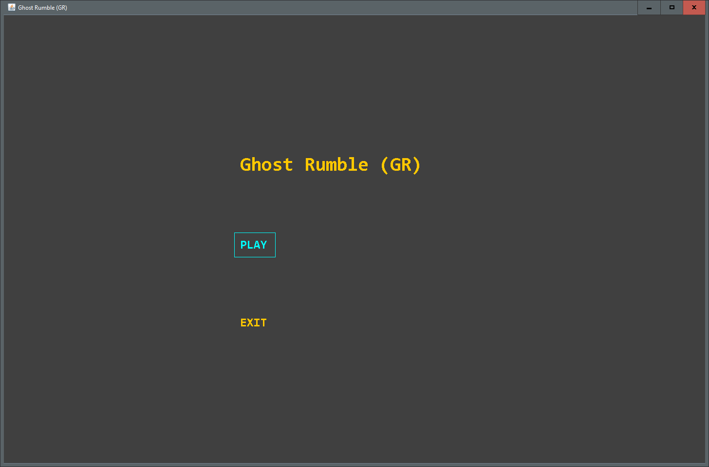
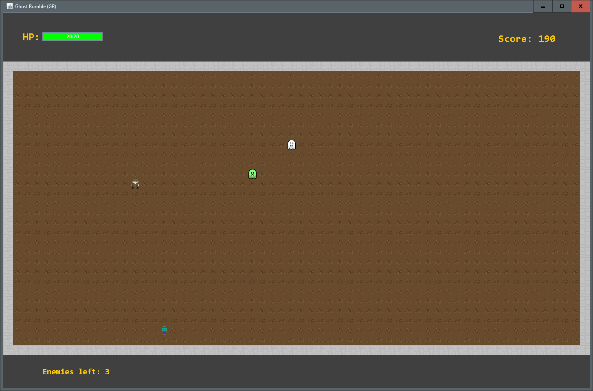
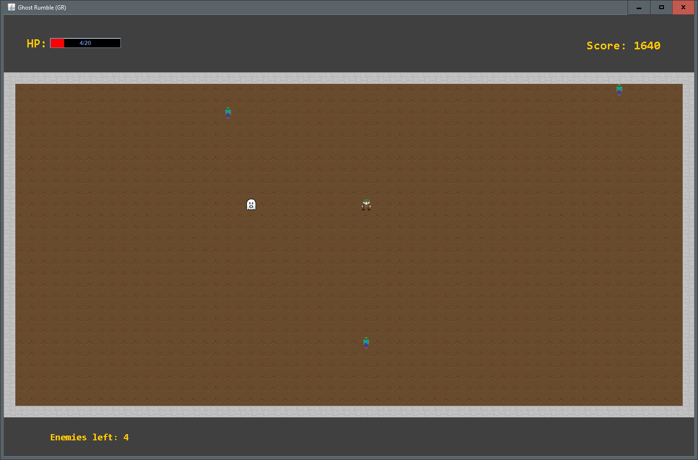
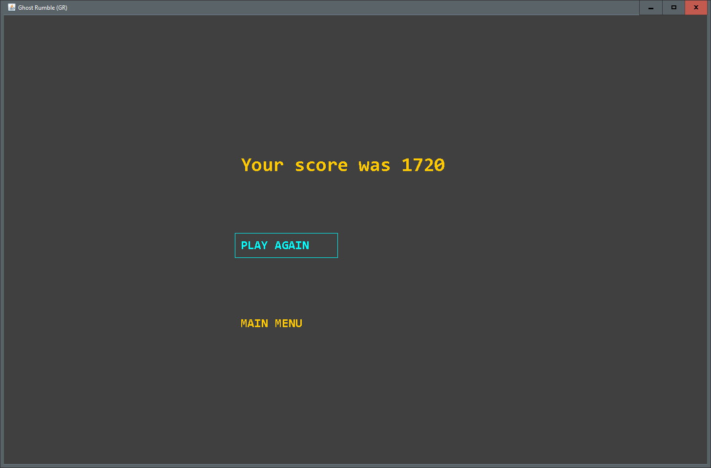

# LPOO_25 Ghost Rumble (GR)

> Ghost Rumble (or GR for short) is a survival arena combat game, in which the player must survive as long as he can inside a mysterious haunted house, filled with ghosts and other spooky creatures that will chase him down and may harm him. :skull: :ghost: 

> The game lasts as long as the player is able to survive and overcome the monsters, by dodging and shooting them. If he lets the enemies get too close and touch him, his health will be lowered; the game ends when the player's HP drops to 0.

## Screenshots

> Some screenshots that illustrate the game.
> Here are some screenshots that ilustrate the general look of our game, as well as the different functionalities:
>

>

>

>

>

>

>

## Install Instructions

> How can someone install the game in their computer:
>> Download the ['code'](code) folder from the repository.
>>
>> Open the folder as a project in IntelliJ IDEA. (Make sure not to accidentally import it :-] to open it is enough.)
>>> Note: Choose the "Use Gradle 'wrapper' task configuration" option.
>>
>> Right click the 'Application' class, from the base package of the project (com.aor.ghostrumble) and choose "Run 'Application.main()'".
>>
>> Done!
