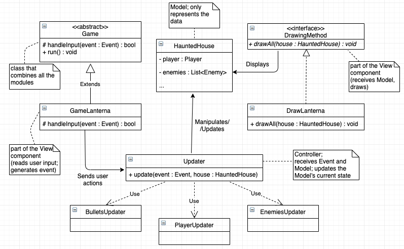
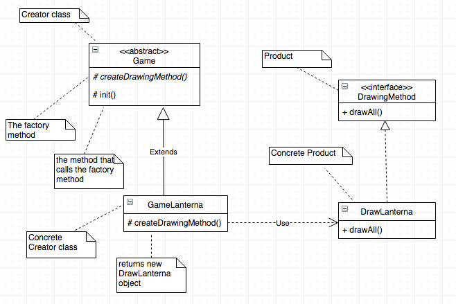
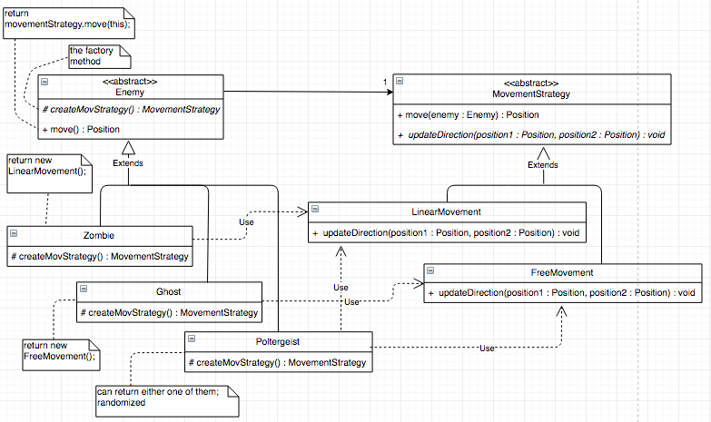
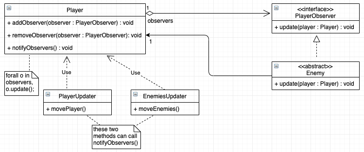
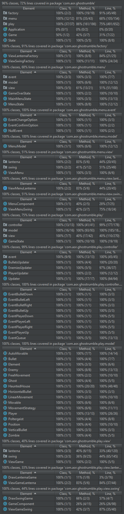
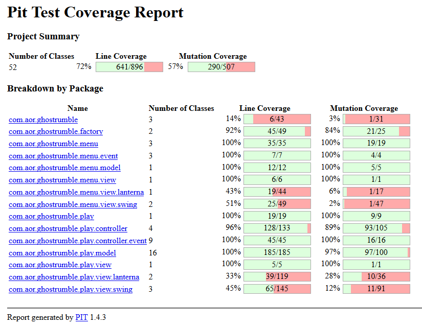

# LPOO_25 Ghost Rumble (GR)

> Ghost Rumble (or GR for short) is a survival arena combat game, in which the player must survive as long as he can inside a mysterious haunted house, filled with ghosts and other spooky creatures that will chase him down and may harm him. :skull: :ghost: 

> The game lasts as long as the player is able to survive and overcome the monsters, by dodging and shooting them. If he lets the enemies get too close and touch him, his health will be lowered; the game ends when the player's HP drops to 0.

> The game is being developed by Eduardo Ribeiro (up201705421@fe.up.pt) and Diogo Machado (up201706832@fe.up.pt).

## Implemented Features

### Player, Walls, and Enemies Representation
> The player character is shown inside a haunted house, delimited by walls, that the player cannot trespass; some monsters, like zombies and ghosts, will appear in the haunted house too.

### Player Movement
> The player is able to move using the WASD keys.

### Movement of the Monsters
> The different types os monsters and creatures each have their own way of travelling arround the map; they also have different speeds.

### Monsters Chase the Player
> The monsters, instead of roaming around the haunted house, will actually pursue the player and try to chase him down.

### Monster Spawning
> From time to time, monsters spawn in the border of the house, and begin to immediatly chase the player down.

### HP Bar
> The player HP bar is shown in the top of the screen; it is green when the HP is medium/high, and it is red and flickering when the HP is low.

### Monsters Causing Damage
> If a monster touches the player, it will die, but it will inflict damage on the player, lowering his HP.

### Shooting/Attacking
> The player will also be able to shoot the monsters from a distance, using the arrow keys, launching a projectile/bullet in a certain direction. If a bullet hits a monster, it will die. The player's gun has a refresh rate, so the player can't be shooting at all times.

### Score
> The current score is displayed at the top right of the screen. It will slowly increment from time to time, if the player manages to keep surviving. It will also increase, by a bigger amount, if an enemy is killed.

### Game Over
> If the player's health goes down to 0, the game resets (the score is set to 0, all the enemies and bullets disappear, etc) and a new game starts. In the console, a message is printed showing the user what was the final score.

## Planned Features
> Some features in this module may never be added to the game; we're still deciding what we should implement or not.

### Main Menu and Game Over Screen
> The game could also have a main menu screen, and a game over screen, for when the player loses.

### Upgrade Spawning in the Haunted House (?)
> From time to time, an upgrade would spawn on a random location of the house; if the player picks it up, it can restore his health, increase his max health, speed, etc, depending on the type of the upgrade.

### Coin Collecting (?)
> In the future there may be coins scattered arround the house, for the player to collect (it could increase the score).

### ... and maybe some more.

## Design
### 1. Separating the Game's Modules
#### 1.1 Problem in Context
> The first problem that we came across was to find a way to separate, in a correct way, the different aspects of our game: the logic module, that would be in charge of the mechanics of the game (the inner workings of the game, such as the player and enemies movement, when the game ends, etc); the drawing module, that would be in charge of transmiting the game´s logic and current state onto the screen, for the user to understand/interact; and others. Performing a correct separation of the game's modules would avoid the violation of the Single Responsability Principle; furthermore, doing so would make it a lot easier if we were to change just one component of the game, such as the drawing method, because we wouldn't need to change the other modules, as they are separated and not dependent.

#### 1.2 The Pattern
> In order to do this, we decided to implement a slightly different version of the MVC (Model - View - Controller) architectural pattern. The Model functions only has a data "warehouse", containing all the information about the game and its current state, but not knowing how and when to change it; the Controller receives the Model and the current Event, and updates the Model accordingly; the View (contrary to the standard MVC pattern) is split in two parts, one that receives the user input and generates the Event that is going to be processed by the Controller, and another one that receives the Model, and is in charge of drawing the current state of the game onto the screen. Finally, we have a Game class that connects all these modules, and contains the main game cycle.

#### 1.3 The Implementation
> Here's how we decided to implement the pattern:

> The classes can be found in the following files:
>
> [Game](../code/src/main/java/com/aor/ghostrumble/Game.java)
>
> [GameLanterna](../code/src/main/java/com/aor/ghostrumble/view/GameLanterna.java)
>
> [DrawingMethod](../code/src/main/java/com/aor/ghostrumble/view/DrawingMethod.java)
>
> [DrawLanterna](../code/src/main/java/com/aor/ghostrumble/view/DrawLanterna.java)
>
> [HauntedHouse](../code/src/main/java/com/aor/ghostrumble/model/HauntedHouse.java)
>
> [Updater](../code/src/main/java/com/aor/ghostrumble/controller/Updater.java)
>
> [PlayerUpdater](../code/src/main/java/com/aor/ghostrumble/controller/PlayerUpdater.java)
>
> [EnemiesUpdater](../code/src/main/java/com/aor/ghostrumble/controller/EnemiesUpdater.java)
>
> [BulletsUpdater](../code/src/main/java/com/aor/ghostrumble/controller/BulletsUpdater.java)

#### 1.4 Consequences
> As said before, using the MVC design (or similar, like we did) increases the modularity of the code. It makes it easier to change only one component of the game, and to keep all the others (for example, deciding to use another way of drawing and reading inputs, other than Lanterna), because although they are linked, the code is not "mixed together" (we would need to create another subclass of Game, that has a new way of reading inputs, and another subclass of DrawingMethod, that would use a new way to draw onto the screen). This shows that our code structure respects the Open-Closed Principle: modules are open for extensions, but closed for modification.
>
> As we also said before, it meets the requirements of the Single Responsability Principle: each module has only one reason to change. In our opinion, separating the View into two parts (one that draws, one that reads user input) contributes even more to the following of this principle.

### 2. Joining the Different View Components
#### 2.1 Problem in Context
> As we said before, when implementing the MVC pattern, we opted to separate the View module into two: one that is in charge of reading user input, and the other is in charge of drawing onto the screen. Because of this, we needed to find a way to join these two modules together (example: if we want to use Lanterna, then we should use the Game subclass GameLanterna, that reads input using Lanterna functions; the drawing aspect should also be done using Lanterna functions, so the class in charge of that should be DrawLanterna).
     
#### 2.2 The Pattern
> For this, we decided to implement the Factory Method design pattern. In the game class, that will have a drawing interface associated, a method will be called to decide the specific way of drawing the elements. In the concrete classes that extend the game class (and are in charge of reading input), we can instanciate the concrete drawing interface that we want for that specific type of game. (We can actually also consider this to be sort of a Strategy pattern too, because the way game class "draws" is to delegate the task to the drawing interface. The different interfaces are the different strategies).
>
> NOTE: if needed, this design pattern can later be changed to an Abstract Factory pattern; for now, we do not feel the need to do that, so we kept it has a regular Factory Method pattern.
     
#### 2.3 Implementation  
> Here's how we decided to implement the design pattern:

> The classes can be found in the following files:
>
>[Game](../code/src/main/java/com/aor/ghostrumble/Game.java)
>
>[GameLanterna](../code/src/main/java/com/aor/ghostrumble/view/GameLanterna.java)
>
>[DrawingMethod](../code/src/main/java/com/aor/ghostrumble/view/DrawingMethod.java)
>
>[DrawLanterna](../code/src/main/java/com/aor/ghostrumble/view/DrawLanterna.java)
        
#### 2.4 Consequences
> The main Game class doesn't need to anticipate what implementation of DrawingMethod it needs to create; it just delegates that decision to the subclasses.
>
> In order to change the View component, we only need to change what Game subclass we use, because doing so changes what drawing interface we use, because of the Factory Method pattern.

### 3. Diferent Ways and Movements for Different Monsters
#### 3.1 Problem in Context
> In order to make the game less "boring" and monotonous, instead of making every enemy move in the same way, we decided to associate each type of enemy to a movement strategy: we wanted Zombies to only be able to move in a straight line, that is, to the left, right, up or down; Ghosts, however, should be able to also move diagonally, so they have free movement around the house. Poltergeists could have either one of the two strategies. So, we needed to find a way to design and structure our code in order to implemement these features. 

#### 3.2 The Pattern
> For this problem, we opted to use a combination of two design patterns, the Factory Method pattern and the Strategy pattern. While we have subclasses representing the different types of enemies, we also have subclasses representing the different types of movement strategies. Each enemy would have a movement strategy associated to it, and when that enemy would need to move to a different position in the house, it would just delegate that action to the movement strategy (ence the Strategy pattern). Because we decided that all Ghosts and all Zombies would have the same strategy, we came to the conclusion that implementing the Factory Method pattern would also be a good choice.

#### 3.3 Implementation
> Here's how we decided to implement the design patterns:
>
> 

> The classes can be found in the following files:
>
> [Enemy](../code/src/main/java/com/aor/ghostrumble/model/Enemy.java)
>
> [Ghost](../code/src/main/java/com/aor/ghostrumble/model/Ghost.java)
>
> [Zombie](../code/src/main/java/com/aor/ghostrumble/model/Zombie.java)
>
> [Poltergeist](../code/src/main/java/com/aor/ghostrumble/model/Poltergeist.java)
>
> [MovementStrategy](../code/src/main/java/com/aor/ghostrumble/model/MovementStrategy.java)
>
> [LinearMovement](../code/src/main/java/com/aor/ghostrumble/model/LinearMovement.java)
>
> [FreeMovement](../code/src/main/java/com/aor/ghostrumble/model/FreeMovement.java)

#### 3.4 Consequences
> The Enemy class and its subclasses do not need to know anything about the processing of the movement (how its done). As said before, it simply delegates that action to the implementation of MovementStrategy, for that enemy.
>
> Conditional logic (if and elses, switch statements) are avoided by using different subclasses and polymorphism.
>
> It would be very easy to add another type of enemy or add another movement strategy, ence respecting the Open-Closed Principle.

### 4. Monsters Chase the Player
#### 4.1 Problem in Context
> A very important part of our game is the fact that enemies will chase the player around the house, in order to get to him and damage him. We needed to find a way for the enemies to know in which direction they should move, based on the current player position, so the monsters would get closer to the player.

#### 4.2 The Pattern
> For this, we decided to implement the Observer pattern. The player would have various observers (all the active/current enemies), and each time the player moved, it would notify all of the enemies, "telling them" about his new position: the enemies would then update the direction in with they should move. (Each time an enemy moves, its direction is also updated).

#### 4.3 Implementation
> Here's how we decided to implement the design pattern:
>
> 

> The classes can be found in the following files:
>
> [Enemy](../code/src/main/java/com/aor/ghostrumble/model/Enemy.java)
>
> [PlayerObserver](../code/src/main/java/com/aor/ghostrumble/model/PlayerObserver.java)
>
> [Player](../code/src/main/java/com/aor/ghostrumble/model/Player.java)
>
> [PlayerUpdater](../code/src/main/java/com/aor/ghostrumble/controller/PlayerUpdater.java)
>
> [EnemiesUpdater](../code/src/main/java/com/aor/ghostrumble/controller/EnemiesUpdater.java)
>
> NOTE: when a PlayerObserver is added as an observer, the update function is also called. This is done so that an enemy will pursue the player as soon as it is spawned, and does not have to wait for the player to move.

#### 4.4 Consequences
> Encapsulation and seperation of the code is promoted: the Player class does not know anything about the Enemy class; in fact, it only knows about PlayerObservers and that it needs to notify them, but does not know what they do or how they do it when that occurs.

## Known Code Smells and Refactoring Suggestions

### 1. Controller Module Centered In Only One Class - SOLVED
#### 1.1 Code Smell
> In the Controller module of our game, all the game's logic and operations are centered in only one class, the Updater class. This class can be considered as a Large Class, containing too many methods and lines of code.

#### 1.2 Refactoring
> One refactoring tecnique that can be applied to eliminate this code smell is the Extract Class tecnique: the Updater class can be split into various classes, like for example PlayerUpdater, EnemiesUpdater, etc, and each one of these classes would be in charge of the logic concerning the player, the enemies, and so on. The main Updater class would have methods that involves the various components, like for example, collision detection between the enemies and the player.

### 2. ProcessEvent() Switch Statement in Updater Class
#### 2.1 Code Smell
> In the Updater class, a method called processEvent() is called in order to, given a specific event, do the operation (call the method) that corresponds to that action/event. For example, if the event type is BULLET_UP, the Updater class will call the methods necessary in order to create a bullet and launch it upwards. This originated a big switch statement, based on type code, in processEvent().

#### 2.2 Refactoring
> Probably one of the best ways to solve this problem is to apply the Replace Type Code with Subclasses refactoring tecnique. Instead of the Event class having an attribute that indicates the current event type, it could have various subclasses, each one for a specific event type (ex: PlayerLeftEvent, BulletUpEvent, etc). Each subclass could have its own implementation of a process() method, that received the Updater and the HauntedHouse (model), and called the right method of the Updater in order to satisfy that event. So, instead of being the Updater class that evaluates the event type and calls the right method, it would be the event itself that called them.
>
> This would eliminate the switch statement in processEvent(), making the code much more readable, as well as ensure that the Open-Closed Principle of SOLID would be followed: if we wanted to add another event type, we wouldn't need to change any existing code, but to create a new subclass that represented the new event type. (Another possible solution would be Replace Type Code with State/Strategy).

### 3. Collision Detection in Updater and HauntedHouse - SOLVED
#### 3.1 Code Smell
> In the Updater class, we have a function hitsEnemies(), that tells if the position given to the method hits any enemy that is in the haunted house. There is a similar function in the HauntedHouse class, checkMonsterInPosition(), that does the same thing. There is no need for these two functions to coexist, as they have the same functionality. This can be viewed as a small version of the Alternative Classes with Different Interfaces code smell.

#### 3.2 Refactoring
> The collision detection methods, like hitsWall() and hitsEnemies(), can be put in the HauntedHouse class, deleting these functions in the Updater class, in order to avoid repetition.

## Testing Results

> Screenshot of test coverage and mutation testing reports:
>
> 
>
> 
>
> [Link to the reports in HTML format](testResults/html)

#### Some notes about the testing results:
> ### Concerning coverage and mutations
> As can be seen, a coverage of 100% was not achieved on the testing of our project. This can be attributed to a number of factors:
>> #### Classes and Methods that only call other methods:
>>
>> Some methods, such as [Application](../code/src/main/java/com/aor/ghostrumble/Application.java).main(), [Game](../code/src/main/java/com/aor/ghostrumble/Game.java).run(), and [Updater](../code/src/main/java/com/aor/ghostrumble/controller/Updater.java).update(), only call other methods, which are already unit tested, making it redundant to test these methods as well.
>
>> #### Random generation of data: 
>>
>> Some of the initialization methods in our project, such as [Updater](../code/src/main/java/com/aor/ghostrumble/controller/Updater.java).addEnemy(), or the constructor of the class [Poltergeist](../code/src/main/java/com/aor/ghostrumble/model/Poltergeist.java), depend on the generation of random values, to keep the game interesting. The first one chooses randomly what type of enemy to spawn on the map, while the second one randomly chooses one of the Movement Strategies implemented, for the Poltergeist object to use. That being the case, we are unable to kill all mutations that can be originated depending on the outcome of these random values.
>
>> #### Purely aesthetic Classes and Methods:
>>
>> Concerning the [DrawLanterna](../code/src/main/java/com/aor/ghostrumble/view/DrawLanterna.java) class, all of its methods are meant only to visually represent the data contained in the classes belonging to the **model** module. Therefore, it wouldn't be the best use of development time to unit test these methods, as the important part is that the model and controller properly process that data, based on user input.
>>
>> Adding to this, the [GameLanterna](../code/src/main/java/com/aor/ghostrumble/view/GameLanterna.java) class calls, in its constructor, methods to initialize the screen. These methods are not tested for on the unit tests that were developed, even though they are covered, for the reasons stated on the paragraph above.
>
>> #### Additional Notes
>> There is also one surviving mutation due to the presence of a System.out.println() call.
>>
>> The number of mutations killed on the class [Poltergeist](../code/src/main/java/com/aor/ghostrumble/model/Poltergeist.java) depends on the results from random number generation, in any given test run.
>>
>> There is a difference between the coverage stats provided by the unit tests on IntelliJ, and those provided by running _pitest_. However, both were run with the exact same code.

> ### Concerning the individuality of the tests
> Due to the structure of our code, there are classes which have the function of calling the proper methods from other classes, while not directly manipulating the data of the game, these classes being the [Updater](../code/src/main/java/com/aor/ghostrumble/controller/Updater.java) class and the [GameLanterna](../code/src/main/java/com/aor/ghostrumble/view/GameLanterna.java) class. For this reason, those methods cannot be properly **unit** tested, as they don't contain any of the data they manipulate. Therefore, we developed tests to see the effect of these methods on the data stored on the model classes, using that data to verify the correct operation of [Updater](../code/src/main/java/com/aor/ghostrumble/controller/Updater.java) and [GameLanterna](../code/src/main/java/com/aor/ghostrumble/view/GameLanterna.java).

## Self-evaluation

> For the intermediate delivery:
>
> Eduardo Ribeiro (up201705421@fe.up.pt): 50%
>
> Diogo Machado (up201706832@fe.up.pt): 50%
