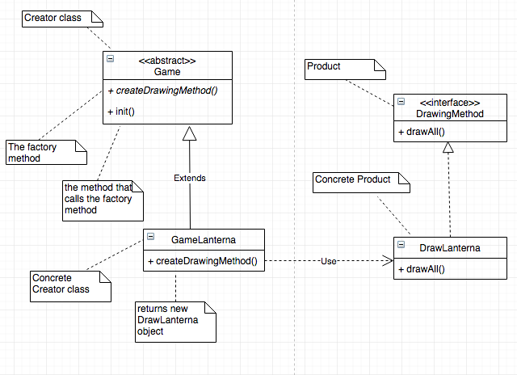

# LPOO_25 Ghost Rumble (GR)

> Ghost Rumble (or GR for short) is a survival arena combat game, in which the player must defeat waves of ghosts and other mysterious enemies, in order to survive.

> The game lasts as long as the player is able to overcome all enemies, which grow in number and power with each passing wave. (Some have claimed to have seen Bosses every 5 waves 👀👀)

> The game is being developed by Eduardo Ribeiro (up201705421@fe.up.pt) and Diogo Machado (up201706832@fe.up.pt).

## Implemented Features

### Player and Walls Representation
> The player character is shown inside a haunted house, delimited by walls, that the player cannot trespass.

### Movement of the Monsters
> The different types os monsters and creatures each have their own way of travelling arround the map; they also have different speeds.

### HP Bar
> The player HP bar is shown in the top of the screen; it is green when the HP is medium/high, and it is red and flickering when the HP is low.

## Planned Features

### Player Movement
> The player will be able to move using the WASD keys.

### Shooting/Attacking
> The player will also be able to shoot the monsters from a distance, launching a projectile/bullet in a certain direction, as well as performing a melee attack (short distance). The concept of limited ammo may also be added to the game.

### Monsters Chase the Player
> The monsters, instead of roaming around the haunted house, will actually pursue the player and try to chase him down.

### Monsters Causing Damage
> If a monster touches the player, it will die, but it will inflict damage on the player, lowering his HP.

### Coin Collecting
> In the future there may be coins scattered arround the house, for the player to collect.

### Upgrade Store
> The player would be able to use those coins in an upgrade store, that would open in the end of a wave, in order to purchase things like health regeneration, damage boost, etc.

### ... and maybe some more.

## Design
### 1. Separating the Game´s Logic and the Drawing Module
     
#### 1.1 Problem in Context
     
> One of the first decisions/problems that we had was to find a way to separate the code for the game's logic (that is, the inner workings of the game, such as the player and enemies movement, when the game ends, etc) from the drawing module, that is in charge of transmiting the game´s logic and current state onto the screen, for the user to understand/interact. Seperating the two modules would help us in the future, if we wanted to change only the drawing module, for example: we wouldn't need to change anything in the logic module, because they are seperated and not dependent.
     
#### 1.2 The Pattern
     
> For this, we decided to implement the Factory Method design pattern. In the game class, that will have a drawing interface associated, a method will be called to decide the specific way of drawing the elements. In the concrete classes that extend the game class, we can instanciate the concrete drawing interface that we want for that specific game. (We can actually also consider this to be sort of a Strategy pattern too, because the way game class "draws" is to delegate the task to the drawing interface. The different interfaces are the different strategies).
     
#### 1.3 Implementation
     
> Here's how we decided to implement the design pattern:

> The classes can be found in the following files:

> [Game](../GhostRumble/src/main/java/com/aor/ghostrumble/Game.java)
>
> [GameLanterna](../GhostRumble/src/main/java/com/aor/ghostrumble/GameLanterna.java)
>
> [DrawingMethod](../GhostRumble/src/main/java/com/aor/ghostrumble/DrawingMethod.java)
>
>[DrawLanterna](../GhostRumble/src/main/java/com/aor/ghostrumble/DrawLanterna.java)
     
    
#### 1.4 Consequences

> As said before, using the design makes it much easier to, in the future, change only the drawing module without the need to change the logic module. It increases the modularity of the code.

> This procedure also ensures that the first SOLID principle, the Single Responsibility Principle, is not violated, because the modules created are only in charge of one specific task, and have only "one reason" to be changed.

## Known Code Smells and Refactoring Suggestions

> This section should describe 3 to 5 different code smells that you have identified in your current implementation, and suggest ways in which the code could be refactored to eliminate them. Each smell and refactoring suggestions should be described in its own subsection.

## Testing Results

> This section should contain screenshots of the main results of both the test coverage and mutation testing reports. It should also contain links to those reports in HTML format (you can copy the reports to the docs folder).

## Self-evaluation

> In this section describe how the work regarding the project was divided between the students. In the event that members of the group do not agree on a work distribution, the group should send an email to the teacher explaining the disagreement.
