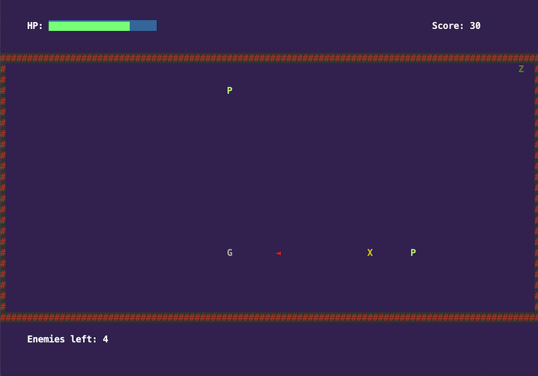
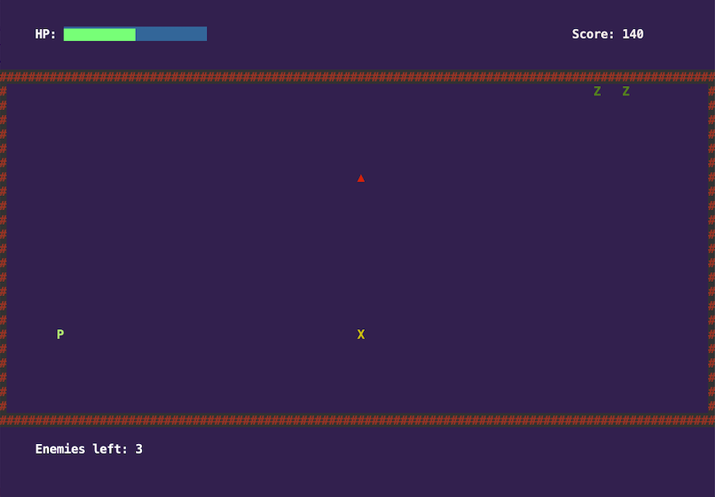

# LPOO_25 Ghost Rumble (GR)

> Ghost Rumble (or GR for short) is a survival arena combat game, in which the player must survive as long as he can inside a mysterious haunted house, filled with ghosts and other spooky creatures that will chase him down and may harm him. :skull: :ghost: 

> The game lasts as long as the player is able to survive and overcome the monsters, by dodging and shooting them. If he lets the enemies get too close and touch him, his health will be lowered; the game ends when the player's HP drops to 0.

> The game was developed by Diogo Machado (up201706832@fe.up.pt) and Eduardo Ribeiro (up201705421@fe.up.pt).

## Implemented Features

### "Retro" and "Modern" Styles
> In the beginning of the game, the user is asked whether they would like to play the "retro" themed game (Lanterna), or the "Modern" version of it (Swing).

### Player, Walls, and Enemies Representation
> The player character is shown inside a haunted house, delimited by walls, that the player cannot trespass; some monsters, like zombies and ghosts, will appear in the haunted house too.

### Player Movement
> The player is able to move using the WASD keys.

### Movement of the Monsters
> The different types of monsters and creatures each have their own way of travelling arround the map; they also have different speeds.

### Monsters Chase the Player
> The monsters, instead of roaming around the haunted house, will actually pursue the player and try to chase him down.

### Monster Spawning
> From time to time, monsters spawn in the border of the house, and begin to immediatly chase the player down.

### HP Bar
> The player HP bar is shown in the top of the screen; it is green when the HP is medium/high, and it is red and flickering when the HP is low.

### Monsters Causing Damage
> If a monster touches the player, it will die, but it will inflict damage on the player, lowering his HP.

### Shooting/Attacking
> The player will also be able to shoot the monsters from a distance, using the arrow keys, launching a projectile/bullet in a certain direction. If a bullet hits a monster, it will die. The player's gun has a refresh rate, so the player can't be shooting at all times.

### Score
> The current score is displayed at the top right of the screen. It will slowly increment from time to time, if the player manages to keep surviving. It will also increase, by a bigger amount, if an enemy is killed.

### Game Over
> If the player's health goes down to 0, the game ends and the player is taken to a game over screen.

### Main Menu and Game Over Screen
> When the game is loaded, the player will be presented with a main menu screen, with the title of the game (Ghost Rumble (GR)) and the options to play and exit the game. As said before, when the player loses, they are taken to a game over screen, where they have the option to play again a new game, or return to the main menu.

### Screenshots
> Here are some screenshots that ilustrate the most important features of our game:
>

>

>

## Planned Features
> As of now (and considering the main focus of the project is the structure of the code and use of design patterns, rather than its complexity and playability), we are happy with the features we have implemented. However, if we had more time, we could've implemented some of the following features:

### Upgrade Spawning in the Haunted House
> From time to time, an upgrade would spawn on a random location of the house; if the player picks it up, it can restore his health, increase his max health, speed, etc, depending on the type of the upgrade.

### Coin Collecting
> There could be coins scattered arround the house, for the player to collect (it could increase the score).

## Design

### 1. Separating the Game's Modules
#### 1.1 Problem in Context
> The first problem that we came across was to find a way to separate, in a correct way, the different aspects of our game: **the logic module**, that would be in charge of the mechanics of the game (the inner workings of the game, such as the player and enemies movement, when the game ends, what option did the player select in the menus, etc); **the drawing module**, that would be in charge of transmiting the game´s logic and current state onto the screen, for the user to understand/interact; and others. Performing a correct separation of the game's modules would avoid the violation of the Single Responsability Principle; furthermore, doing so would make it a lot easier if we were to change just one component of the game, such as the drawing method, because we wouldn't need to change the other modules, as they would be correctly separated.

#### 1.2 The Pattern
> In order to do this, we decided to implement the MVC (Model - View - Controller) architectural pattern. In our project, we have two different MVC structures: one for the **main game**, and the other for the **main menu and game over screens**.
>
> In the main game MVC, the Model functions only has a data "warehouse", containing all the information about the game and its current state, and also some functions to modify it, but not knowing when to change it and why; the Controller receives the Model and an EventQueue, that contains all the current game events, and updates the Model accordingly; and finally, the View, that is in charge of receiving the user input and generating a GameEvent that is added to the EventQueue (that is going to be processed by the Controller); the View also receives the Model, and is in charge of drawing the current state of the game onto the screen. All these functionalities are combined in the main game cycle.
>
> In the menus MVC, we have a different Model and View, related to the existing information in that part of the game. We also have a different group of events, the MenuEvents, that represent the possible changes that could be made and triggered by user inputs; some of these events update the Model accordingly. The View, just like the main game's View, receives user input, creates the correct event, and draws the Model onto the screen.

#### 1.3 The Implementation
> Here's how we decided to implement the pattern:
>
> Main game MVC:

> The classes can be found in the following files:
>
> [ViewGame](../code/src/main/java/com/aor/ghostrumble/play/view/ViewGame.java)
>
> [ViewGameLanterna](../code/src/main/java/com/aor/ghostrumble/play/view/lanterna/ViewGameLanterna.java)
>
> [ViewGameSwing](../code/src/main/java/com/aor/ghostrumble/play/view/swing/ViewGameSwing.java)
>
> [HauntedHouse](../code/src/main/java/com/aor/ghostrumble/play/model/HauntedHouse.java)
>
> [Updater](../code/src/main/java/com/aor/ghostrumble/play/controller/Updater.java)
>
> [PlayerUpdater](../code/src/main/java/com/aor/ghostrumble/play/controller/PlayerUpdater.java)
>
> [EnemiesUpdater](../code/src/main/java/com/aor/ghostrumble/play/controller/EnemiesUpdater.java)
>
> [BulletsUpdater](../code/src/main/java/com/aor/ghostrumble/play/controller/BulletsUpdater.java)
>
> Menus MVC:

> The classes can be found in the following files:
>
> [ViewMenu](../code/src/main/java/com/aor/ghostrumble/menu/view/ViewMenu.java)
>
> [ViewMenuLanterna](../code/src/main/java/com/aor/ghostrumble/menu/view/lanterna/ViewMenuLanterna.java)
>
> [ViewMenuSwing](../code/src/main/java/com/aor/ghostrumble/menu/view/swing/ViewMenuSwing.java)
>
> [MenuModel](../code/src/main/java/com/aor/ghostrumble/menu/model/MenuModel.java)
>
> [MenuEvent](../code/src/main/java/com/aor/ghostrumble/menu/event/MenuEvent.java)
>
> [EventChangeOption](../code/src/main/java/com/aor/ghostrumble/menu/event/EventChangeOption.java)
>
> [EventConfirmOption](../code/src/main/java/com/aor/ghostrumble/menu/event/EventConfirmOption.java)
>
> [NullEvent](../code/src/main/java/com/aor/ghostrumble/menu/event/NullEvent.java)
>
> In the main game View, we opted to separate the input and event creation module from the drawing module. We did that by putting those functionalities into two different classes (for example ViewGameLanterna and DrawLanternaGame), and making the Draw class an attribute of the main View class; when the main View class needs to draw the model, it delegates that action to the Draw class. We did this because even though the two modules aren't exactly independent and separated (one depends on the other), in our point of view it contributed not only to the non-violation of the Single Responsability Principle, but also to the simplification of each class, given the size of the drawing functions for the main game.
>
> In the menus section, however, because of the simplicity of the drawing functions (compared to the main game), we opted to not separate the two, and keep all functionality in the main View class, in order to avoid unnecessary complexity to the code.
>
> Another important subject regarding this pattern is the lack of a Controller module in the menus "MVC". Because the menus are so simple, the only real operation that could be done to the menu Model is the change of one option to the other. We felt like it was unnecessary to create a Controller class just for this operation, and that it would add unneeded complexity to the code's structure. The operations on the model are done directly by some MenuEvents (so in a way they can be seen as part of the controller).

#### 1.4 Consequences
> As said before, using the MVC design increases the modularity of the code. It makes it easier to change only one component of the game, and to keep all the others (for example, choosing whether to use Lanterna or Swing in order to draw the various components of the game, and read user input), because although they are linked, the code is not "mixed together" (we would only need to change the View component, keeping the Model and Controller intact). This shows that our code structure respects the Open-Closed Principle: for example, if we wanted our game to have another way of drawing itself and receive user input, we would need to create another View class, that implemented the right functionalities, and link it to the Model and Controller, without having to change any existing code. Modules are open for extensions, but closed for modification.
>
> As we also said before, it also meets the requirements of the Single Responsability Principle: each module has only one reason to change. In our opinion, as we said before, in a way, separating the main game View into two classes (one that draws, one that reads user input) contributes even more to the following of this principle.

### 2. Drawing and Reading User Input With Both Laterna and Swing
#### 2.1 Problem in Context
> As an extra requirement, it was asked that our game should work with either Lanterna or Swing. Having the ability to do so would show that the game was well implemented, in terms of structure; we would only need to change the Views of the main game and menu, in order to do that. Therefore, we needed to find and implement a way to create the right View types (Lanterna or Swing, Menu or Game), given the circunstance and also depending if the player chose Lanterna or Swing in the beggining of the game.
     
#### 2.2 The Pattern
> For this, we decided to implement, as was recommended, the Abstract Factory desgin pattern. We have an abstract factory, that has methods to create the main game View and the menu View, to be overridden in the concrete factories. The concrete factories are specific for Lanterna and Swing; these factories override the methods from the abstract factory and are able to produce the right Views.
>
> As said before, in the very beginning of the game, the user is asked whether he would like to run the game with Swing or Lanterna. Based on their answer, the right concrete factory is created and passed to the game; when the menu View or the main game View is needed, all that needs to be done is to call the appropriate method for that.
     
#### 2.3 Implementation  
> Here's how we decided to implement the design pattern:

> The classes can be found in the following files:
>
> [ViewAbstractFactory](../code/src/main/java/com/aor/ghostrumble/factory/ViewAbstractFactory.java)
>
> [ViewLanternaFactory](../code/src/main/java/com/aor/ghostrumble/factory/ViewLanternaFactory.java)
>
> [ViewSwingFactory](../code/src/main/java/com/aor/ghostrumble/factory/ViewSwingFactory.java)
>
> [ViewMenu](../code/src/main/java/com/aor/ghostrumble/menu/view/ViewMenu.java)
>
> [ViewMenuLanterna](../code/src/main/java/com/aor/ghostrumble/menu/view/lanterna/ViewMenuLanterna.java)
>
> [ViewMenuSwing](../code/src/main/java/com/aor/ghostrumble/menu/view/swing/ViewMenuSwing.java)
>
> [ViewGame](../code/src/main/java/com/aor/ghostrumble/play/view/ViewGame.java)
>
> [ViewGameLanterna](../code/src/main/java/com/aor/ghostrumble/play/view/lanterna/ViewGameLanterna.java)
>
> [ViewGameSwing](../code/src/main/java/com/aor/ghostrumble/play/view/swing/ViewGameSwing.java)
>
> NOTE: The factory, after it is created at the beginning of the program, it is passed to the game class, which then passes it to the game state so he can instanciate the proper view type (the states will be covered later in the report).
>
#### 2.4 Consequences
> The main advantage of the usage of this pattern is the ease to change product families (in this case, between the Lanterna family of views and Swing family of views); the only thing that needs to be done, as said before, is just change what type of concrete factory we are using to create those views. We can see this in our [Application](../code/src/main/java/com/aor/ghostrumble/Application.java) class.
>
> It also promotes consistency between products/views: using this technique will ensure that all views created are either from Lanterna or Swing.

### 3. Main Menu and Game Over Screens, and Changing Between Them
#### 3.1 Problem in Context
> In order to make our project feel like a proper game, we came across the idea of adding a main menu screen, and a game over screen as well. In the main menu, the player would have the option to play a new game, or to exit. After losing or quiting the current game, the user would then be taken to a game over screen, where they would choose between playing again a new game, or to return to the main menu.
>
> We then needed to find a way to implement and join these different parts of the game, and to correctly transfer from one part to another, without overly using conditional logic, which could violate the Open-Closed Principle.

#### 3.2 The Pattern
> The pattern implemented was actually a mixture and combined usage of two different design patterns, the State pattern and the Observer pattern.
>
> We can have an abstract class/interface for a generic state. Each of its concrete subclasses would represent a different game state, so we would have a different class for the play state, the main menu state, and the game over state. Each one of them would have the necessary information to function (for example, the main game state would have the main game MVC inside it, so it can update the game accordingly).
>
> The main Game class, that would have the main game cycle, would keep track of the current state; in the cycle, the actions of reading user input, drawing the game and updating the game would be delegated to the current state, which would then delegate it to its MVC (ex: when calling the draw method of a state, the state would call the draw method of the view that is inside him).
>
> Furthermore, the state would also have a state observer (which would be the game class); the state observer would have the ability to change state. Whenever that is needed, the current state creates the correct new state and tells the observer to change its state to it.

#### 3.3 Implementation
> Here's how we decided to implement the design pattern:

> The classes can be found in the following files:
>
> [StateObserver](../code/src/main/java/com/aor/ghostrumble/StateObserver.java)
>
> [Game](../code/src/main/java/com/aor/ghostrumble/Game.java)
>
> [State](../code/src/main/java/com/aor/ghostrumble/State.java)
>
> [GameState](../code/src/main/java/com/aor/ghostrumble/play/GameState.java)
>
> [MenuState](../code/src/main/java/com/aor/ghostrumble/menu/MenuState.java)
>
> [MainMenuState](../code/src/main/java/com/aor/ghostrumble/menu/MainMenuState.java)
>
> [GameOverState](../code/src/main/java/com/aor/ghostrumble/menu/GameOverState.java)
>
> NOTE: While implementing this pattern, we realized that the model and view for the states representing the game over and the main menu would be very similar, because these states essentially do the same thing: they present to the user a title, and two options that the player can choose from. We then decided (as it is shown in the diagram) to make an abstract class, MenuState, that the GameOverState and MainMenuState would be subclasses of. The only thing these classes have is an update() method, because that is the only thing that really separates the two; the events that can happen and the drawing of the model is the same for both cases.
>
> This was done in order to prevent code duplication, because if we had the menus MVC in both the GameOverState and MainMenuState, a lot of the functionalities would be the same.
>
#### 3.4 Consequences
> One big advantage of the use of this technique is the lack of need for conditional statements/logic in the game class: instead of it doing different things given the current state, it simply delegates those actions to the actual state.
>
> It is also fairly easy to add a new state to the game: we would need to have another State subclass, that would override and implement the necessary methods to function, and we would also need to incorporate it to the "diagram" of state transitions, specifying when to go to that state and when to leave it. It shows that the Open-Closed Principle is not violated.

### 4. Diferent Ways and Movements for Different Monsters
#### 4.1 Problem in Context
> In order to make the game less "boring" and monotonous, instead of making every enemy move the same way, we decided to associate each type of enemy to a movement strategy: we wanted Zombies to only be able to move in a straight line, that is, to the left, right, up or down; Ghosts, however, should be able to also move diagonally, so they have free movement around the house. Poltergeists could have either one of the two strategies. So, we needed to find a way to design and structure our code in order to implemement these features. 

#### 4.2 The Pattern
> For this problem, we opted to use a combination of two design patterns, the Factory Method pattern and the Strategy pattern. While we have subclasses representing the different types of enemies, we also have subclasses representing the different types of movement strategies. Each enemy would have a movement strategy associated to it, and when that enemy would need to move to a different position in the house, it would just delegate that action to the movement strategy (ence the Strategy pattern). Because we decided that all Ghosts and all Zombies would have the same strategy, we came to the conclusion that implementing the Factory Method pattern would also be a good choice.

#### 4.3 Implementation
> Here's how we decided to implement the design patterns:
>
> 

> The classes can be found in the following files:
>
> [Enemy](../code/src/main/java/com/aor/ghostrumble/play/model/Enemy.java)
>
> [Ghost](../code/src/main/java/com/aor/ghostrumble/play/model/Ghost.java)
>
> [Zombie](../code/src/main/java/com/aor/ghostrumble/play/model/Zombie.java)
>
> [Poltergeist](../code/src/main/java/com/aor/ghostrumble/play/model/Poltergeist.java)
>
> [MovementStrategy](../code/src/main/java/com/aor/ghostrumble/play/model/MovementStrategy.java)
>
> [LinearMovement](../code/src/main/java/com/aor/ghostrumble/play/model/LinearMovement.java)
>
> [FreeMovement](../code/src/main/java/com/aor/ghostrumble/play/model/FreeMovement.java)

#### 4.4 Consequences
> The Enemy class and its subclasses do not need to know anything about the processing of the movement (how its done). As said before, it simply delegates that action to the implementation of MovementStrategy, for that enemy.
>
> Conditional logic (if and elses, switch statements) are avoided by using different subclasses and polymorphism.
>
> It would be very easy to add another type of enemy or add another movement strategy, ence respecting the Open-Closed Principle.

### 5. Monsters Chase the Player
#### 5.1 Problem in Context
> A very important part of our game is the fact that enemies will chase the player around the house, in order to get to him and damage him. We needed to find a way for the enemies to know in which direction they should move, based on the current player position, so the monsters would get closer to the player.

#### 5.2 The Pattern
> For this, we decided to implement the Observer pattern. The player would have various observers (all the active/current enemies), and each time the player moved, it would notify all of the enemies, "telling them" about his new position: the enemies would then update the direction in with they should move. (Each time an enemy moves, its direction is also updated).

#### 5.3 Implementation
> Here's how we decided to implement the design pattern:
>
> 

> The classes can be found in the following files:
>
> [Enemy](../code/src/main/java/com/aor/ghostrumble/play/model/Enemy.java)
>
> [PlayerObserver](../code/src/main/java/com/aor/ghostrumble/play/model/PlayerObserver.java)
>
> [Player](../code/src/main/java/com/aor/ghostrumble/play/model/Player.java)
>
> [PlayerUpdater](../code/src/main/java/com/aor/ghostrumble/play/controller/PlayerUpdater.java)
>
> [EnemiesUpdater](../code/src/main/java/com/aor/ghostrumble/play/controller/EnemiesUpdater.java)
>
> NOTE: when a PlayerObserver is added as an observer, the update function is also called. This is done so that an enemy will pursue the player as soon as it is spawned, and does not have to wait for the player to move.

#### 5.4 Consequences
> Encapsulation and seperation of the code is promoted: the Player class does not know anything about the Enemy class; in fact, it only knows about PlayerObservers and that it needs to notify them, but does not know what they do or how they do it when that occurs.

### 6. Event Queue and Event Processing
#### 6.1 Problem in Context
> Previously in our code, in order to detect and process user input, we did the following: if an important key was pressed, we would create an event, and in order to process it we had a big switch statement, that called diferent methods to update the game, given the specific event type. We wanted to eliminate this switch statement, as it is a code smell, and find a way to properly process the events generated by user input.

#### 6.2 The Pattern
> We came to the conclusion that the Command design pattern would be appropriate to solve this issue. In the main game section, instead of processing one event at a time, we now have an event queue, that stores all events that were generated and not yet processed. In order to eliminate the switch statement, the events themselves are the ones calling the apropriate functions. For the main controller class to process the events, all it has to do is call the event queue method that processes all the events in it (after that, the queue is emptied).

#### 6.3 Implementation
> Here's how we decided to implement the design pattern (the diagram shows the design in the part of the project where this design pattern is in "full force", that is, in the main game section. We also implemented a similiar version of this in the menus section, but without the event queue, given the simplicity of the user interaction in that part of the game.):
>
> 
>
> The classes can be found in the following files:
>
> [Updater](../code/src/main/java/com/aor/ghostrumble/play/controller/Updater.java)
>
> [PlayerUpdater](../code/src/main/java/com/aor/ghostrumble/play/controller/PlayerUpdater.java)
>
> [BulletsUpdater](../code/src/main/java/com/aor/ghostrumble/play/controller/BulletsUpdater.java)
>
> [EventQueue](../code/src/main/java/com/aor/ghostrumble/play/controller/event/EventQueue.java)
>
> [GameEvent](../code/src/main/java/com/aor/ghostrumble/play/controller/event/GameEvent.java)
>
> [EventBulletDown](../code/src/main/java/com/aor/ghostrumble/play/controller/event/EventBulletDown.java)
>
> [EventPlayerUp](../code/src/main/java/com/aor/ghostrumble/play/controller/event/EventPlayerUp.java)
>
> [... (all the other GameEvent subclasses)](../code/src/main/java/com/aor/ghostrumble/play/controller/event)

#### 6.4 Consequences
> As we said before, using this tecnique eliminates the switch statement that we had previously in the Updater class; all the event logic is done inside the specific Event subclasses.
>
> However, perhaps the biggest advantage of the usage of this design pattern in this situation is the fact that, now, it is extremely easy to add new events if we wanted to. This part of our code respects the Open-Closed Principle.

## Known Code Smells and Refactoring Suggestions

### 1. Event Subclasses and Their Utility
#### 1.1 Code Smell
> We would first like to refer that these Event subclasses were made so that we could implement the Command pattern (as described in the section above), in order to eliminate some bigger and more concerning code smells and bad practices, like the overuse of conditional logic and the violation of the Open-Closed Principle.
>
> Having said that, the Event subclasses could be interpreted, in a way, as Lazy Classes, because all they do is override the process() method of their respective interface, that calls another method of another class, usually.

#### 1.2 Refactoring
> We could avoid this smell by eliminating the event subclasses and making a main Event class, that would have an enumeration type or any other method of identifying the concrete event that the object is representing. The class would need to have some conditional statements in order to call the right method, given the type of event to be processed (Collapse Hierarchy).
>
> However, we don't think this refactor would be a good idea, as it would clearly violate the Open-Closed Principle, and also make the code harder to understand and difficult to change.

### 2. Input Handling between Lanterna and Swing
#### 2.1 Code Smell
> Because of the way Lanterna works in terms of receiving user input, the code had to be written in such a way that this task is performed by an isolated method handleInput(), which is called on a separate thread, so as to not interfere with the drawing and updating of the game, while an input is not received. Swing, however, works differently, being able to automatically receive user inputs (by implementing the KeyListener interface), thus eliminating the need for a separate thread to wait for the user to type.
>
> Therefore, due to the way our code is structured, both Lanterna and Swing views need to implement the handleInput() method. However, due to the reasons stated above, the implementation of this method on Swing doesn't need to actually do anything (Refused Bequest).

#### 2.2 Refactoring
> Since this hierarchy is appropriate and makes sense, a new class (e.g., ViewNeedsInput) would have to be created, as a subclass of the main view abstract class (ViewMenu or ViewGame). That main view would then have all the methods used by both versions of it (Lanterna and Swing), and ViewNeedsInput would have an abstract method for handleInput(), so that all the concrete views that required such a method would implement it. The Swing views, would be direct subclasses of ViewMenu and ViewGame, as they do not need the method, while the Lanterna views would be subclasses of ViewNeedsInput, and implement handleInput() (Extract Superclass).
>
> We opted not to perform this refactoring, as it would, in our opinion, add an unnecessary degree of complexity to our code, and although this smell is indeed present, it is not so on a large scale, being limited to a single method.

### 3. Similarities between the Abstract Views for Menu and Game
#### 3.1 Code Smell
> If one looks at the abstract classes ViewMenu and ViewGame, they could very quickly notice that they require a few common methods from their respective subclasses, these methods being prepareStateChange(), handleInput() and drawAll() (Duplicate Code).

#### 3.2 Refactoring
> This smell could be eliminated by creating a universal View interface, containing the referred methods, and making the supramentioned classes implement it (Extract Superclass).
>
> We decided against this refactoring technique, in this case, as the classes require and handle different models, which should not be generalized, as each is very unique and individual.

## Testing Results

> Screenshot of test coverage and mutation testing reports:
>
> 
>
> 
>
> 
>
> [Link to the reports in HTML format](testResults/html)

#### Some notes about the testing results:
> ### Concerning coverage and mutations
> As can be seen, a coverage of 100% was not achieved on the testing of our project. This can be attributed to a number of factors:
>> #### Classes and Methods that only call other methods:
>>
>> Some methods, such as [Application](../code/src/main/java/com/aor/ghostrumble/Application.java).main() and [Game](../code/src/main/java/com/aor/ghostrumble/Game.java).run(), only call other methods, which are already unit tested, making it redundant to test these methods as well.
>
>> #### Random generation of data: 
>>
>> Some of the initialization methods in our project, such as [EnemiesUpdater](../code/src/main/java/com/aor/ghostrumble/play/controller/EnemiesUpdater.java).addEnemy(), or the constructor of the class [Poltergeist](../code/src/main/java/com/aor/ghostrumble/play/model/Poltergeist.java), depend on the generation of random values, to keep the game interesting. The first one chooses randomly what type of enemy to spawn on the map, while the second one randomly chooses one of the Movement Strategies implemented, for the Poltergeist object to use. That being the case, we are unable to kill all mutations that can be originated depending on the outcome of these random values.
>
>> #### Purely aesthetic Classes and Methods:
>>
>> Concerning the "drawer" classes, like [DrawLanternaGame](../code/src/main/java/com/aor/ghostrumble/play/view/DrawLanternaGame.java) and similar, all of its methods are meant only to visually represent the data contained in the classes belonging to the **model** module. Therefore, it wouldn't be the best use of development time to unit test these methods, as the important part is that the model and controller properly process that data, based on user input.
>
>> #### Additional Notes
>> While it is stated above that the drawing methods are not tested, we do test the **view** methods that are related to user input, in order to know if, based on the input received, they are creating the concrete event that corresponds to the pressing of that key. In order to that, some screens may pop up and "start acting weird", but it is all necessary to test those functionalities.
>>
>> While IntelliJ shows the coverage percentage for a package including the ones inside it, the Pit Test Coverage Report only displays the coverage percentage for the classes in the base of that package, which is why the numbers differ. In addition, it is worth noting that due to differences in rounding from both frameworks, there are some small differences in the percentages shown (e.g., in the package com.aor.ghostrumble.factory, both show a coverage of 45/49 lines, while showing different percentages, 91% vs 92%). This is no reason for concern, as all tests were run on the final version of the code.

> ### Concerning the individuality of the tests
> Due to the structure of our code, there are classes which have the function of calling the proper methods from other classes, while not directly manipulating the data of the game; some of these classes being the updater classes in the main Controller module ([Updater](../code/src/main/java/com/aor/ghostrumble/play/controller/Updater.java), [PlayerUpdater](../code/src/main/java/com/aor/ghostrumble/play/controller/PlayerUpdater.java), [EnemiesUpdater](../code/src/main/java/com/aor/ghostrumble/play/controller/EnemiesUpdater.java) and [BulletsUpdater](../code/src/main/java/com/aor/ghostrumble/play/controller/BulletsUpdater.java)). For this reason, some of those methods cannot be properly **unit** tested, as they don't contain any of the data they manipulate. Therefore, in those cases, we developed tests to see the effect of the methods on the data stored on the model classes, using that data to verify the correct operation of those methods, in the classes stated above.

## Self-evaluation
> Eduardo Ribeiro (up201705421@fe.up.pt): 50%
>
> Diogo Machado (up201706832@fe.up.pt): 50%
